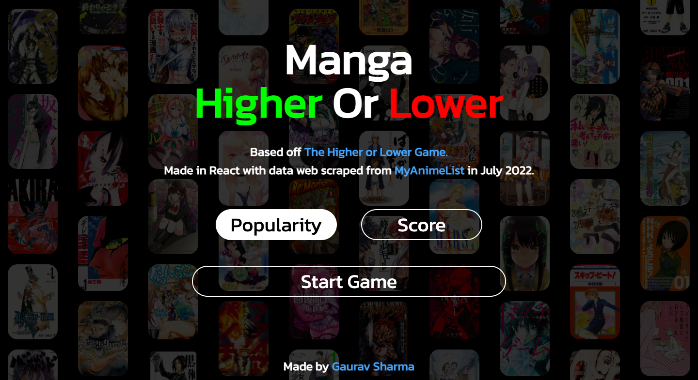
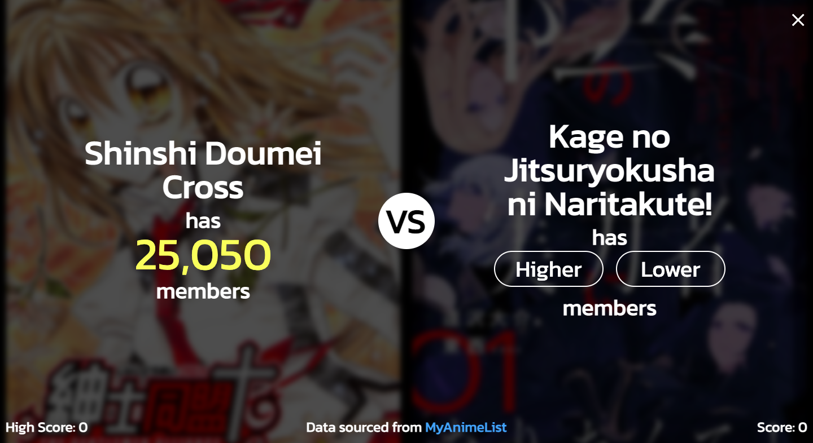
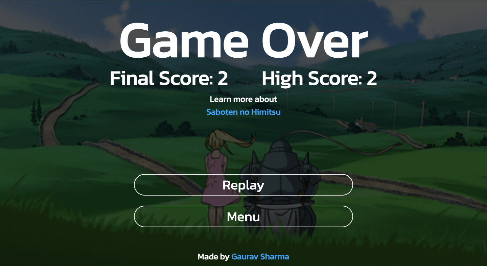

# Manga Higher Or Lower

Test your **Manga Knowledge** in this website.
Choose which of two _randomly_ selected manga has the higher **popularity** or **rating** based on MyAnimeList users.

This website was built for fun and to familiarize myself with **React** and **APIs**.

# https://mangahigherlower.netlify.app/

Players can choose between comparing popularity or rating.

Players must choose between higher or lower.

Once Player loses, they can choose to replay with the same metric or go back to the menu.

Made in **React** with data web scraped from _MyAnimeList_ in July 2022
Based off the higher lower game (http://www.higherlowergame.com/)

The webscraped data and code can be viewed here: https://github.com/GauravS43/MangaAPI
It contains the 1999 most popular manga on MAL (https://myanimelist.net/topmanga.php)
